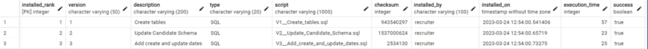
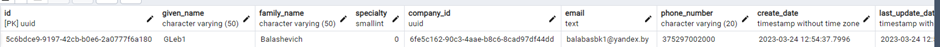
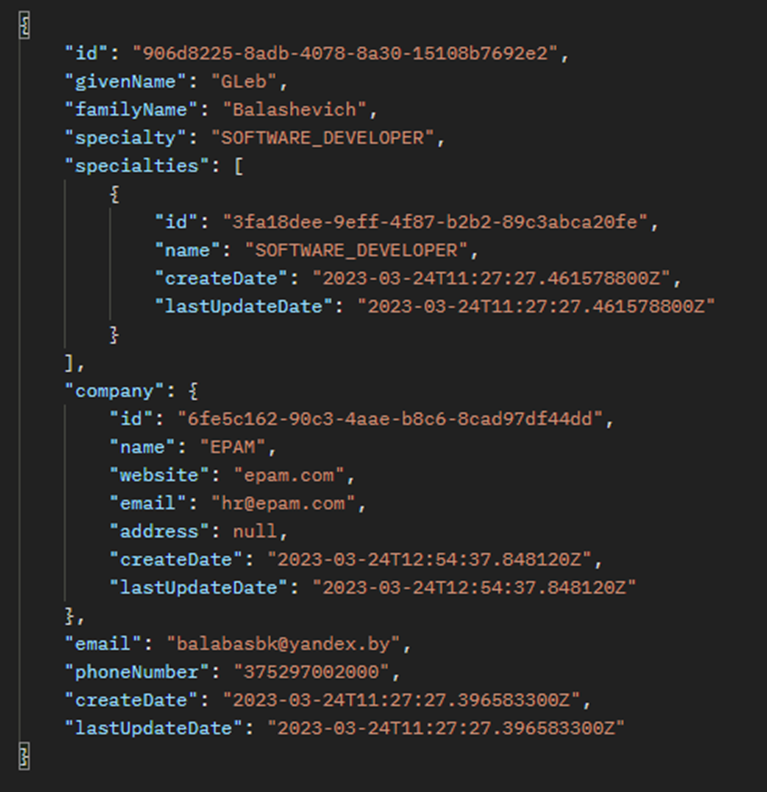
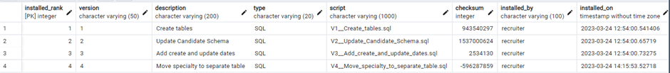
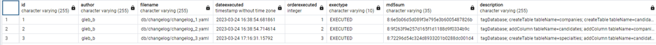
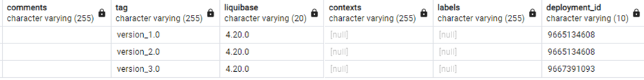
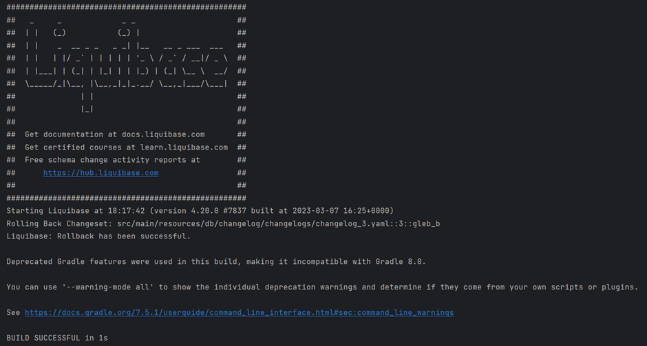

# Database migration tools

Made a spring boot recruitment app. Main entities are **Candidate** and **Company**, _Postgresql_ was chosen as database. Both approaches with **FlyWay** and **Liquibase** were implemented. To enable one of it service should be started with `flyway` or `liquibase` profile. All scripts placed in `resources` directory.

### Flyway:
1.	V1 Migration creates initial DB schema
2.	V2 Migration normalizes schema to fit business requirements
3.	V3 Migration adds auditing to tables
4.	V4 Migration moves candidate’s specialty to separate table
5.	V4.1 Migration rollback changes applied in V4. Made as regular migration due to unsupporting undo operations by community flyway 

### Liquibase:
1. 1 Changelog creates initial DB schema
2. 2 Changelog adds auditing to tables
3. 3 Changelog moves candidate’s specialty to separate table

All changelogs where tagged with "version_X.X".
Rollback operation was executed using Liquibase gradle plugin: `'rollback -PliquibaseCommandValue=version_2.0'` and 3rd changelog was rolled back:

